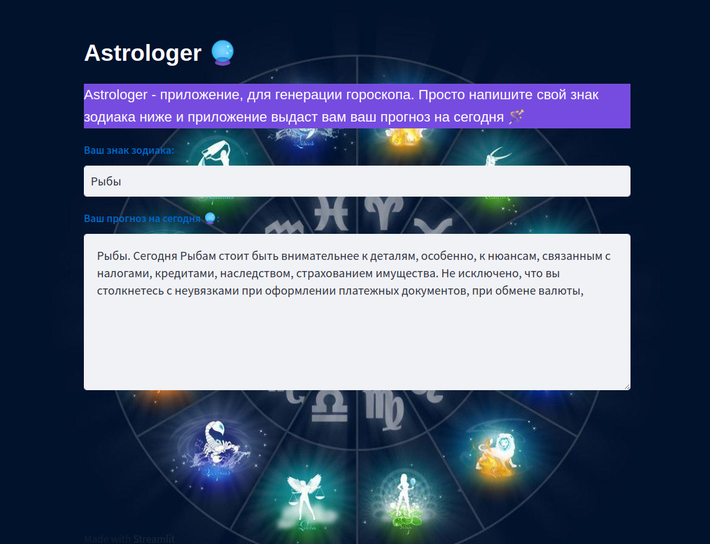

# Astrologer 🔮

 <b> Astrologer </b> - это приложение для генерации гороскопа по знаку зодиака.

 Интерфейс приложения: 

  

### Шаги реализации приложения:

- Парсинг датасета с сайтов гороскопов и searching готового датасета.
- Обучение модели GPT2 с помощью PyTorch.
- Разработка веб-приложения с помощью [Streamlit](https://streamlit.io/).

### Запуск приложения:
Скачать репозиторий и ввести команды в терминале:

``python -m venv .venv``

``pip install requirements.txt``

Для запуска приложения ввести команду:

``streamlit run astrologer_app.py``

### Ссылка на приложение: [Astrologer](https://avpuzynina-astrologer-astrologer-app-rpqtpu.streamlit.app/)
